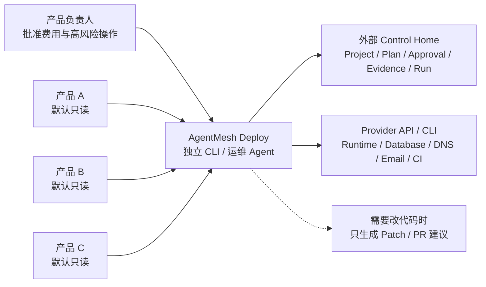
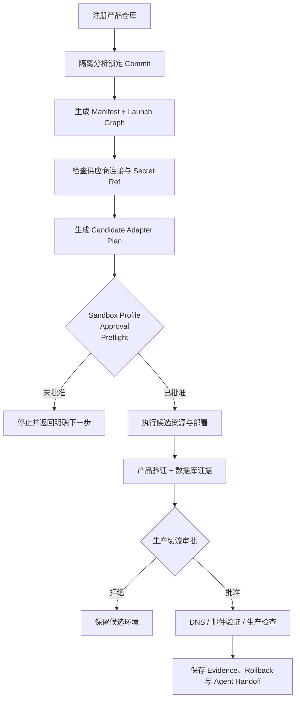
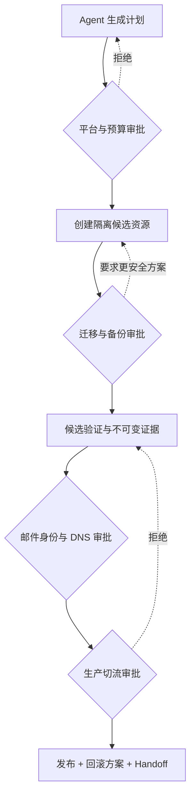

# AgentMesh Deploy

> Independent deployment operations for AI coding agents.

AgentMesh Deploy 是一个独立的发布运维 CLI。它接手任意 Git 产品仓库，分析技术栈，生成供应商计划，
在明确审批后创建候选资源、部署应用、迁移数据库、配置 DNS 与邮件域名，并保存可恢复的执行证据。

[](LICENSE)
[](package.json)

**产品官网：<https://deploy.agentmesh360.com/>**

## 为什么是独立运维 Agent

AgentMesh Deploy 不作为 Sidecar 写进产品仓库。产品代码默认只读，部署契约、审批、Secret Ref、
供应商状态、不可变 Receipt 和恢复记录都保存在独立控制目录中。



这意味着同一个 Agent 可以连续接管多个产品，而不会把 AgentMesh Deploy 的状态、工作流或凭证写入
这些产品的 Git 工作区。

## 核心能力

- **仓库分析**：锁定 Git Commit，在隔离 Checkout 中识别框架、构建命令、环境变量与部署形态。
- **供应商编排**：从 Launch Graph 自动编译 Provider Adapter Plan，无需手写供应商动作 JSON。
- **候选优先**：先创建 Sandbox/Candidate，验证通过后才允许生成生产 DNS ChangeSet。
- **数据库保护**：Schema 检查、迁移分类、Snapshot/Backup Evidence、事务执行和恢复边界。
- **DNS 与邮件联合流程**：Cloudflare 精确记录集与 Resend Domain Intent、Verify/Poll 联合编排。
- **人工审批**：费用、购买、迁移、邮件身份、生产切流和删除动作保持显式授权。
- **中断恢复**：Intent 先落盘，Receipt 后记账；Resume 优先接管已发生事实，不盲目重放 Mutation。
- **Secret 隔离**：只持久化 `env://`、`keychain://`、`op://` 或自定义 `secret://` 引用。

## 支持的核心供应商

| 领域 | 供应商 | 当前能力 |
| --- | --- | --- |
| 前端与 Serverless | Vercel | Project、构建配置、文件制品、Preview Deploy、Poll |
| 应用运行时 | Railway | Project、Environment、Service、Service Domain、Candidate Deploy |
| PostgreSQL | Neon | Project、Branch、Schema、Snapshot、Migration、连接 Secret Sink |
| 托管后端 | Supabase | Organization、Project、健康检查、Runtime Credentials |
| DNS | Cloudflare | Zone 接管、不可变 DNS ChangeSet、精确 Create/Update、回滚证据 |
| 事务邮件 | Resend | Domain、DNS Intent、Verify/Poll、受控发送与交付验证 |

旧版 Manifest 执行器还包含 Docker/Caddy、DigitalOcean、GitHub Actions、Cloudflare Workers/D1/R2/KV
等迁移期能力；新的项目级 First Launch 工作流以独立 V2 控制平面为主。

## 发布链路



## 安装

### GitHub Release

需要 Node.js 20 或更高版本，以及已登录的 GitHub CLI：

```bash
release_dir="$(mktemp -d)"
gh release download v0.2.1 \
  --repo jiyangnan/AgentMesh-Deploy-Agent \
  --pattern 'agentmesh-deploy-*.tgz' \
  --pattern 'SHA256SUMS' \
  --dir "$release_dir"
(cd "$release_dir" && shasum -a 256 -c SHA256SUMS)
npm install --global "$release_dir"/agentmesh-deploy-*.tgz
agentmesh-deploy version
```

## 快速开始

以下命令只创建外部控制对象，不会修改产品仓库，也不会调用供应商：

```bash
export AGENTMESH_DEPLOY_HOME="$HOME/.agentmesh-deploy"

agentmesh-deploy project add \
  --repo /absolute/path/to/your-product \
  --id my-saas \
  --name "My SaaS" \
  --json

agentmesh-deploy analyze my-saas --json

agentmesh-deploy first-launch start my-saas \
  --owner product-owner \
  --deadline 2027-01-01T00:00:00.000Z \
  --secret-backend keychain \
  --json
```

`first-launch start` 返回 Bootstrap Plan、人工 Handoff 和下一条可执行命令。后续 Agent 应根据返回对象
继续配置 Connection、Launch Settings、Sandbox Profile、Approval 与 Preflight，而不是绕过控制平面
直接调用供应商。

常用只读命令：

```bash
agentmesh-deploy project list --json
agentmesh-deploy project show my-saas --json
agentmesh-deploy status --json
agentmesh-deploy help first-launch
agentmesh-deploy help sandbox
```

## 安全模型

AgentMesh Deploy 默认失败关闭：

1. 产品仓库在操作前后都会计算 Guard Fingerprint。
2. Control Home 必须与产品仓库物理分离。
3. 供应商网络、Mutation、费用和最终确认是不同门槛。
4. Adapter Plan、Approval、Preflight、Receipt 和 Evidence 绑定同一 Graph 与指纹。
5. Secret Value 不允许出现在 Plan、Run、State、日志或命令参数中。
6. DNS 只执行经过审阅的精确记录集；邮件记录默认 Create-only。
7. 删除、降级迁移、Snapshot Restore 与生产切流需要单独批准。
8. 缺少 Receipt 的不确定 Mutation 不会自动重放，必须先与供应商事实对账。



## 给 AI Agent 的调用原则

- 先读取命令 JSON 输出中的 `nextActions`，不要猜测下一条命令。
- 先运行只读 readiness/preflight，再申请 Mutation Approval。
- 不要把 Token、连接串或私钥写入配置文件；只提供 Secret Ref。
- 不要把测试资源与用户已有产品资源混用。
- 不要把 Candidate Evidence 当作 Production Evidence。
- 不要为了通过验收自动升级套餐、购买域名或删除既有资源。

更完整的边界说明见 [架构文档](docs/ARCHITECTURE.md) 与 [安全策略](SECURITY.md)。

## 公开仓库边界

本仓库是由 AgentMesh Deploy 私有研发源仓经过白名单门禁生成的公开发行镜像，只包含可运行 CLI、
公开契约、用户示例、通用架构文档与产品官网。内部路线图、项目进度、验收记录、研发测试、供应商账号、
真实资源标识和发布工作流不会进入公开仓库，也不接受从公开仓库反向同步研发状态。

每个公开版本都从一个明确的私有源仓 Commit 重新生成并经过内容扫描；GitHub Release 中的压缩包是推荐的
安装入口。

## AgentMesh360 产品矩阵

本产品是 [AgentMesh360](https://agentmesh360.com/) 产品矩阵的一员：一个账户驱动多个垂直 AI Agent。

| 产品 | 仓库 | 官网 |
|---|---|---|
| AgentMesh-JobAgent（AI 求职：Boss 直聘 / 猎聘 / 智联招聘 / 51Job） | [jiyangnan/AgentMesh-JobAgent](https://github.com/jiyangnan/AgentMesh-JobAgent) | [jobagent.agentmesh360.com](https://jobagent.agentmesh360.com/zh/) |
| AgentMesh-CreatorCut（口播与产品录屏的 AI 后期） | [jiyangnan/AgentMesh-CreatorCut](https://github.com/jiyangnan/AgentMesh-CreatorCut) | [creatorcut.agentmesh360.com](https://creatorcut.agentmesh360.com/zh/) |
| AgentMesh-Lecturecast（课程视频智能生产） | [jiyangnan/AgentMesh-Lecturecast](https://github.com/jiyangnan/AgentMesh-Lecturecast) | [lecturecast.agentmesh360.com](https://lecturecast.agentmesh360.com/zh/) |
| AgentMesh-Runtime（AI Agent 本机记忆与恢复） | [jiyangnan/AgentMesh-Runtime](https://github.com/jiyangnan/AgentMesh-Runtime) | [runtime.agentmesh360.com](https://runtime.agentmesh360.com/zh/) |
| AgentMesh-Deploy-Agent（开源发布运维 Agent） | [jiyangnan/AgentMesh-Deploy-Agent](https://github.com/jiyangnan/AgentMesh-Deploy-Agent) | [deploy.agentmesh360.com](https://deploy.agentmesh360.com/zh/) |
| AgentMesh-OfficialRecruitment（官网招聘申请工作台） | [jiyangnan/AgentMesh-OfficialRecruitmentAgent](https://github.com/jiyangnan/AgentMesh-OfficialRecruitmentAgent) | [recruit.agentmesh360.com](https://recruit.agentmesh360.com/zh/) |

## 许可证

AgentMesh Deploy 使用 [Apache License 2.0](LICENSE)。
