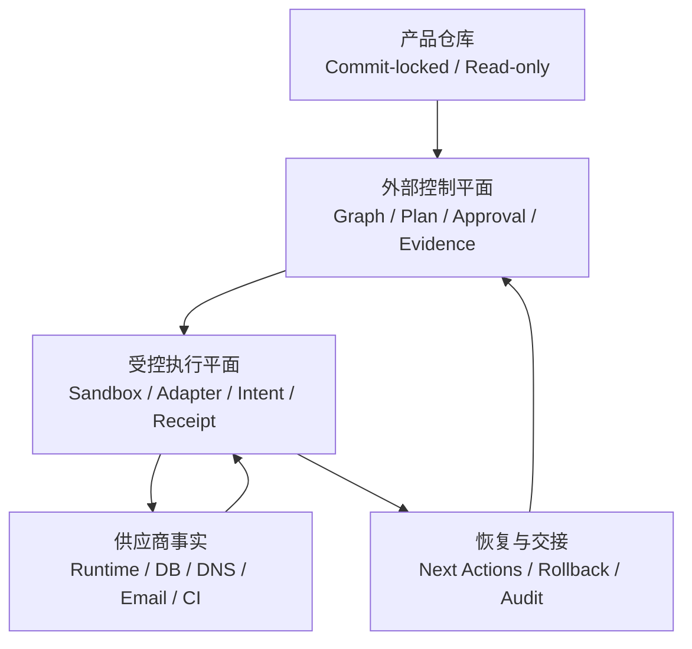
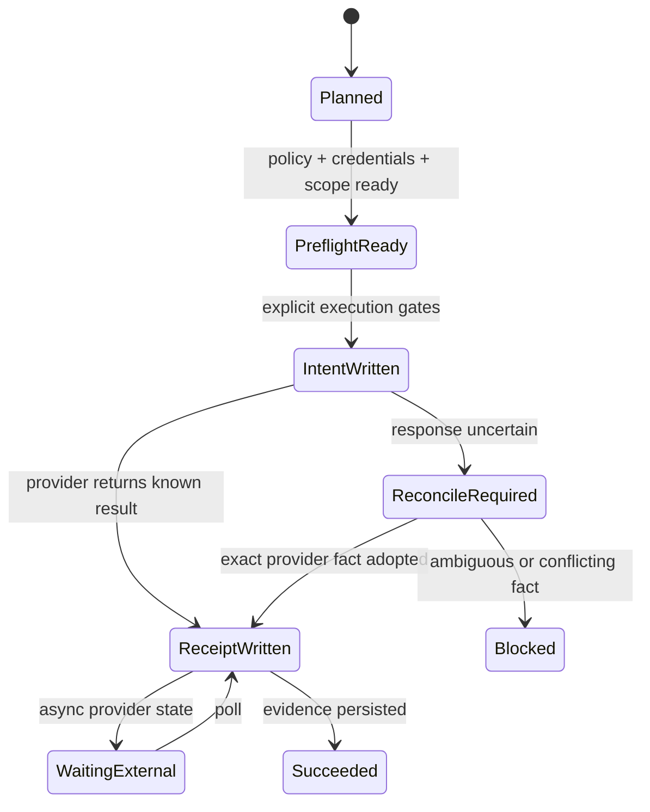

# 架构

AgentMesh Deploy 是位于产品仓库之外的独立部署控制平面。它把“理解产品”和“修改云端事实”拆成可审计、
可恢复的阶段，并让 AI Agent 与产品负责人通过结构化对象协作。

## 四层结构

1. **Source Layer**：产品 Git 仓库与锁定 Commit，默认只读。
2. **Control Layer**：Project、Manifest、Launch Graph、Configuration、Plan、Approval、Evidence。
3. **Execution Layer**：Provider Adapter、Sandbox Profile、Preflight、Intent、Receipt、Resume。
4. **Handoff Layer**：下一动作、人工证明、生产验证、Rollback 与跨 Agent 交接。

## 不可变控制对象

关键对象使用内容指纹与所有权字段绑定：

- Project ID 与 Source Commit；
- Launch Graph 与 Configuration；
- Adapter Plan 与准确 Connection；
- Sandbox Profile 与允许的供应商、域名、Host、费用和 Mutation 数量；
- Approval 与 Node、Scope、Owner、Expiry；
- Receipt 与 Run、Action、Intent Fingerprint；
- Evidence 与准确 Run Revision。

任一绑定漂移都必须在供应商网络调用前失败。

## 执行与恢复

Intent 必须先于 Provider Mutation 持久化。进程中断后，Resume 读取 Intent/Receipt 与供应商事实：已经完成
的动作被接管，等待中的动作只 Poll，不确定动作先 Reconcile，不能默认再次 Mutation。

## Provider Adapter

Adapter 只接受规范化输入并返回规范化结果。控制平面负责权限、预算和所有权；Adapter 负责固定 Host API、
资源身份、Provider Error 映射、幂等计划与执行。原始供应商响应不能直接写入持久化对象。

## 产品仓库边界

Control Home 默认为 `~/.agentmesh-deploy`。隔离 Checkout、构建 Artifact、Provider State 和所有审批证据
都写入该目录。若部署确实需要修改产品代码，AgentMesh Deploy 只能生成外部 Patch Proposal，由产品
所有者在原仓库中审阅和合并。
